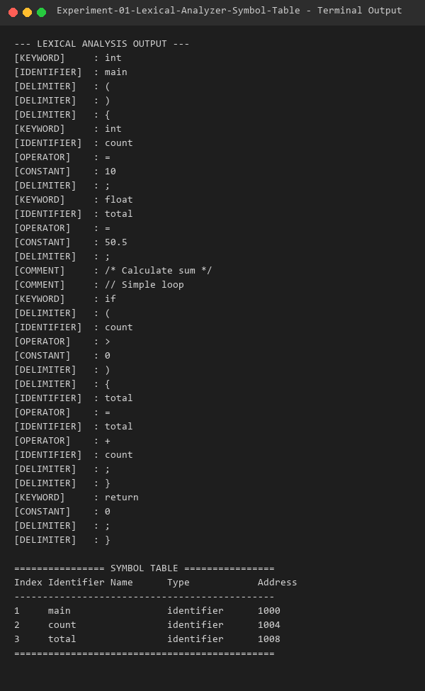

# Experiment 01 - Lexical Analyzer and Symbol Table

## Aim
To develop a lexical analyzer using the LEX tool to recognize C patterns (such as identifiers, constants, comments, and operators) and to construct a symbol table for the recognized identifiers.

## Algorithm
1. Include required C headers (`stdio.h`, `stdlib.h`, `string.h`) and declare the symbol table structure.
2. Define regular expressions in the LEX file for:
   - **Identifiers**: `[a-zA-Z_][a-zA-Z0-9_]*`
   - **Constants**: `[0-9]+(\.[0-9]+)?`
   - **Comments**: `/* ... */` and `// ...`
   - **Operators**: `+`, `-`, `*`, `/`, `=`, `==`, `<`, `>`, `<=`, `>=`, `!=`
   - **Keywords**: `int`, `float`, `char`, `double`, `void`, `return`, `if`, `else`, `while`, `for`
3. Write LEX rules to print each token category when matched.
4. When an identifier is recognized, invoke `insertSymbol()` to add it to the symbol table if not already present.
5. In the `main()` function, read the input C file, trigger `yylex()`, and display the populated symbol table.
6. Compile using Flex and GCC, then test with a sample C source program.

## Files
- `lexical.l`: Lexical analyzer specification file written in LEX/Flex.
- `sample_input.c`: Sample C source code used for testing.
- `output.txt`: Captured terminal output log.

## Requirements
- GCC Compiler (`gcc`)
- Flex Lexical Analyzer (`flex`)

## Compilation
```bash
flex lexical.l
gcc lex.yy.c -o lexical
```

## Execution
```bash
./lexical sample_input.c
```

## Sample Input
```c
int main() {
    int count = 10;
    float total = 50.5;
    /* Calculate sum */
    // Simple loop
    if (count > 0) {
        total = total + count;
    }
    return 0;
}
```

## Sample Output



```text
--- LEXICAL ANALYSIS OUTPUT ---
[KEYWORD]     : int
[IDENTIFIER]  : main
[DELIMITER]   : (
[DELIMITER]   : )
[DELIMITER]   : {
[KEYWORD]     : int
[IDENTIFIER]  : count
[OPERATOR]    : =
[CONSTANT]    : 10
[DELIMITER]   : ;
[KEYWORD]     : float
[IDENTIFIER]  : total
[OPERATOR]    : =
[CONSTANT]    : 50.5
[DELIMITER]   : ;
[COMMENT]     : /* Calculate sum */
[COMMENT]     : // Simple loop
[KEYWORD]     : if
[DELIMITER]   : (
[IDENTIFIER]  : count
[OPERATOR]    : >
[CONSTANT]    : 0
[DELIMITER]   : )
[DELIMITER]   : {
[IDENTIFIER]  : total
[OPERATOR]    : =
[IDENTIFIER]  : total
[OPERATOR]    : +
[IDENTIFIER]  : count
[DELIMITER]   : ;
[DELIMITER]   : }
[KEYWORD]     : return
[CONSTANT]    : 0
[DELIMITER]   : ;
[DELIMITER]   : }

================ SYMBOL TABLE ================
Index Identifier Name      Type            Address   
----------------------------------------------
1     main                 identifier      1000      
2     count                identifier      1004      
3     total                identifier      1008      
==============================================
```

## Result
The LEX program to recognize C patterns and build a symbol table was successfully implemented, compiled, and verified.
