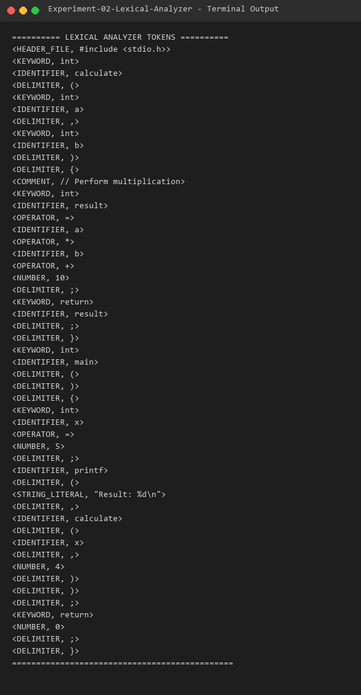

# Experiment 02 - Lexical Analyzer

## Aim
To design and implement a Lexical Analyzer using the LEX tool to read C source code and classify tokens into preprocessor directives, header files, keywords, identifiers, numbers, string literals, operators, comments, and delimiters.

## Algorithm
1. Define regular expression patterns in the LEX specification file for each C token class:
   - Header Files (`#include <...>`)
   - Preprocessor Directives (`#define ...`)
   - Keywords (`int`, `float`, `char`, `if`, `else`, `return`, etc.)
   - Identifiers (`[a-zA-Z_][a-zA-Z0-9_]*`)
   - Numbers (`[0-9]+(\.[0-9]+)?`)
   - String Literals (`"..."`)
   - Comments (`/* ... */` and `// ...`)
   - Operators (`+`, `-`, `*`, `/`, `=`, `==`, `<`, `>`, etc.)
   - Delimiters (`{`, `}`, `(`, `)`, `;`, `,`)
2. Attach printing actions to output tokens in `<TOKEN_CLASS, lexeme>` format.
3. Ignore white spaces and newlines during scanning.
4. Pass input C source file to `yyin` and call `yylex()`.
5. Compile with Flex and GCC, then test using a sample C program file.

## Files
- `lexer.l`: LEX specification file for the lexical analyzer.
- `sample_input.c`: C program input file for token extraction.
- `output.txt`: Generated token list.

## Requirements
- GCC Compiler (`gcc`)
- Flex Lexical Analyzer (`flex`)

## Compilation
```bash
flex lexer.l
gcc lex.yy.c -o lexer
```

## Execution
```bash
./lexer sample_input.c
```

## Sample Input
```c
#include <stdio.h>

int calculate(int a, int b) {
    // Perform multiplication
    int result = a * b + 10;
    return result;
}

int main() {
    int x = 5;
    printf("Result: %d\n", calculate(x, 4));
    return 0;
}
```

## Sample Output



```text
========== LEXICAL ANALYZER TOKENS ==========
<HEADER_FILE, #include <stdio.h>>
<KEYWORD, int>
<IDENTIFIER, calculate>
<DELIMITER, (>
<KEYWORD, int>
<IDENTIFIER, a>
<DELIMITER, ,>
<KEYWORD, int>
<IDENTIFIER, b>
<DELIMITER, )>
<DELIMITER, {>
<COMMENT, // Perform multiplication>
<KEYWORD, int>
<IDENTIFIER, result>
<OPERATOR, =>
<IDENTIFIER, a>
<OPERATOR, *>
<IDENTIFIER, b>
<OPERATOR, +>
<NUMBER, 10>
<DELIMITER, ;>
<KEYWORD, return>
<IDENTIFIER, result>
<DELIMITER, ;>
<DELIMITER, }>
<KEYWORD, int>
<IDENTIFIER, main>
<DELIMITER, (>
<DELIMITER, )>
<DELIMITER, {>
<KEYWORD, int>
<IDENTIFIER, x>
<OPERATOR, =>
<NUMBER, 5>
<DELIMITER, ;>
<IDENTIFIER, printf>
<DELIMITER, (>
<STRING_LITERAL, "Result: %d\n">
<DELIMITER, ,>
<IDENTIFIER, calculate>
<DELIMITER, (>
<IDENTIFIER, x>
<DELIMITER, ,>
<NUMBER, 4>
<DELIMITER, )>
<DELIMITER, )>
<DELIMITER, ;>
<KEYWORD, return>
<NUMBER, 0>
<DELIMITER, ;>
<DELIMITER, }>
==============================================
```

## Result
The C lexical analyzer using the LEX tool was successfully implemented and verified.
