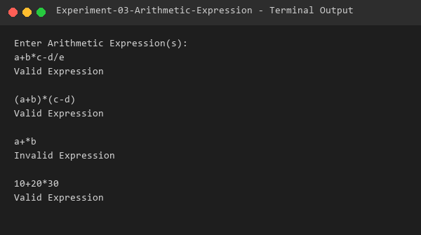

# Experiment 03 - Arithmetic Expression

## Aim
To write a program using LEX and YACC tools to recognize valid arithmetic expressions using operators `+`, `-`, `*`, and `/`.

## Algorithm
### LEX Specification (`art_expr.l`):
1. Match identifiers (`[a-zA-Z_][a-zA-Z0-9_]*`) and return token `ID`.
2. Match numeric digits (`[0-9]+`) and return token `DIG`.
3. Return individual characters (`+`, `-`, `*`, `/`, `(`, `)`, `\n`) for syntax processing.
4. Ignore white space spaces and tabs.

### YACC Grammar (`art_expr.y`):
1. Define token definitions for `ID` and `DIG`.
2. Define operator precedence and associativity:
   - `%left '+' '-'`
   - `%left '*' '/'`
   - `%right UMINUS`
3. Define grammar productions for valid arithmetic expressions (`expn -> expn '+' expn`, `expn -> '-' expn`, `expn -> '(' expn ')'`, `DIG`, `ID`).
4. Print `"Valid Expression"` when grammar matches, or call `yyerror()` printing `"Invalid Expression"` on syntax failure.

## Files
- `art_expr.l`: LEX specification for tokenizing arithmetic lexemes.
- `art_expr.y`: YACC grammar specification for checking expression validity.
- `sample_input.txt`: Sample expressions test input.
- `output.txt`: Captured terminal output log.

## Requirements
- GCC Compiler (`gcc`)
- Flex Lexical Analyzer (`flex`)
- Bison Parser Generator (`bison`)

## Compilation
```bash
bison -d art_expr.y
flex art_expr.l
gcc art_expr.tab.c lex.yy.c -o art_expr
```

## Execution
```bash
./art_expr < sample_input.txt
```

## Sample Input
```text
a+b*c-d/e
(a+b)*(c-d)
a+*b
10+20*30
```

## Sample Output



```text
Enter Arithmetic Expression(s):
a+b*c-d/e
Valid Expression

(a+b)*(c-d)
Valid Expression

a+*b
Invalid Expression

10+20*30
Valid Expression
```

## Result
The LEX and YACC program to recognize valid arithmetic expressions was successfully implemented and verified.
