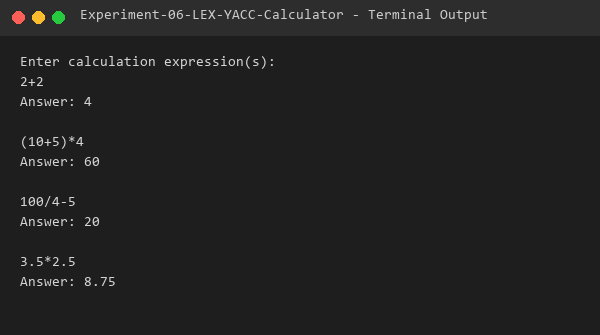

# Experiment 06 - LEX YACC Calculator

## Aim
To implement a arithmetic desktop calculator program using LEX and YACC tools supporting addition, subtraction, multiplication, division, unary negation, and parentheses with proper operator precedence.

## Algorithm
### LEX Specification (`cal.l`):
1. Match integers and floating-point constants using pattern `[0-9]+(\.[0-9]+)?`.
2. Convert lexeme text to floating-point number via `atof()` and assign to `yylval`.
3. Return `NUM` token to YACC parser.
4. Pass operators (`+`, `-`, `*`, `/`, `(`, `)`, `\n`) to parser and ignore spaces.

### YACC Grammar (`cal.y`):
1. Set `#define YYSTYPE double` for arithmetic evaluation.
2. Define operator precedence and associativity:
   - `%left '+' '-'`
   - `%left '*' '/'`
   - `%right UMINUS`
3. Semantic rules evaluate mathematical expressions:
   - Addition: `$$ = $1 + $3`
   - Subtraction: `$$ = $1 - $3`
   - Multiplication: `$$ = $1 * $3`
   - Division: `$$ = $1 / $3` (with divide-by-zero check)
   - Negation: `$$ = -$2`
4. Output result formatted as `Answer: %g`.

## Files
- `cal.l`: LEX specification file tokenizing numerical constants.
- `cal.y`: YACC specification file defining arithmetic evaluation rules.
- `sample_input.txt`: Test calculation expressions input file.
- `output.txt`: Captured terminal verification log.

## Requirements
- GCC Compiler (`gcc`)
- Flex Lexical Analyzer (`flex`)
- Bison Parser Generator (`bison`)

## Compilation
```bash
bison -d cal.y
flex cal.l
gcc cal.tab.c lex.yy.c -o calc -lm
```

## Execution
```bash
./calc < sample_input.txt
```

## Sample Input
```text
2+2
(10+5)*4
100/4-5
3.5*2.5
```

## Sample Output



```text
Enter calculation expression(s):
Answer: 4

Answer: 60

Answer: 20

Answer: 8.75
```

## Result
The calculator program using LEX and YACC tools was successfully implemented and verified.
