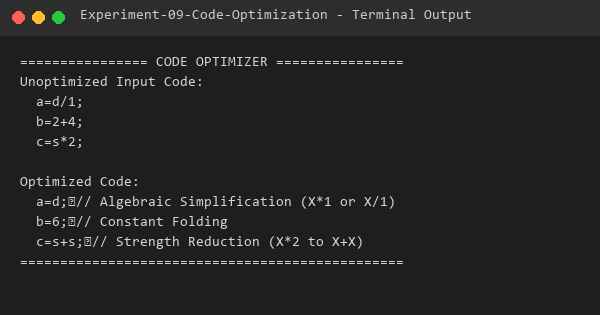

# Experiment 09 - Code Optimization

## Aim
To write a C program to implement machine-independent code optimization techniques including Constant Folding, Strength Reduction, and Algebraic Simplification on intermediate Three-Address Code.

## Algorithm
1. Read lines of intermediate Three-Address Code (TAC) statements.
2. For each TAC statement, extract components: left-hand side variable, first operand, operator, and second operand.
3. Apply optimization rules iteratively:
   - **Constant Folding**: If both operands are integer literals, evaluate the expression at compile-time (e.g., `b = 2 + 4` -> `b = 6`).
   - **Algebraic Simplification**: Replace identity operations with simplified equivalents (e.g., `a = d / 1` -> `a = d`, `x * 1` -> `x`).
   - **Strength Reduction**: Replace expensive operations with cheaper operations (e.g., `c = s * 2` -> `c = s + s`).
4. Output the optimized TAC statements along with the applied transformation annotations.

## Files
- `optimize.c`: C program source implementing code optimization passes.
- `sample_input.txt`: Input file with unoptimized TAC statements.
- `output.txt`: Captured terminal verification log.

## Requirements
- GCC Compiler (`gcc`)

## Compilation
```bash
gcc optimize.c -o optimize
```

## Execution
```bash
./optimize
```

## Sample Input
```text
a=d/1;
b=2+4;
c=s*2;
```

## Sample Output



```text
================ CODE OPTIMIZER ================
Unoptimized Input Code:
  a=d/1;
  b=2+4;
  c=s*2;

Optimized Code:
  a=d;	// Algebraic Simplification (X*1 or X/1)
  b=6;	// Constant Folding
  c=s+s;	// Strength Reduction (X*2 to X+X)
================================================
```

## Result
The C program implementing code optimization techniques (Constant Folding, Strength Reduction, Algebraic Simplification) was successfully built, tested, and verified.
