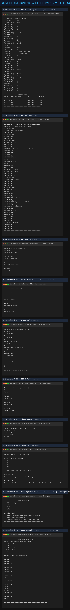

# Compiler Design Lab (CS4501)

This repository contains verified implementations, source code, and execution outputs for the **CS4501 Compiler Design Laboratory** experiments.

All programs are implemented using **C**, **LEX / FLEX** (Lexical Analyzer Generator), and **YACC / Bison** (Parser Generator), compiled with **GCC**, and tested against standard inputs.

---

## Experiments Index

1. **[Experiment 01: Lexical Analyzer & Symbol Table](Experiment-01-Lexical-Analyzer-Symbol-Table/)**
   - *Aim*: Develop a lexical analyzer using LEX to recognize C patterns (identifiers, constants, comments, operators) and create a symbol table.
   - *Files*: `lexical.l`, `sample_input.c`, `output.txt`

2. **[Experiment 02: Lexical Analyzer](Experiment-02-Lexical-Analyzer/)**
   - *Aim*: Implement a Lexical Analyzer using LEX Tool to scan C source code and classify tokens.
   - *Files*: `lexer.l`, `sample_input.c`, `output.txt`

3. **[Experiment 03: Arithmetic Expression](Experiment-03-Arithmetic-Expression/)**
   - *Aim*: Recognize valid arithmetic expressions using operators `+`, `-`, `*`, and `/` using LEX and YACC.
   - *Files*: `art_expr.l`, `art_expr.y`, `sample_input.txt`, `output.txt`

4. **[Experiment 04: Valid Variable](Experiment-04-Valid-Variable/)**
   - *Aim*: Recognize valid variable names (starting with a letter followed by letters or digits) using LEX and YACC.
   - *Files*: `valvar.l`, `valvar.y`, `sample_input.txt`, `output.txt`

5. **[Experiment 05: Control Structures](Experiment-05-Control-Structures/)**
   - *Aim*: Recognize valid C control structures (`if`, `if-else`, `for`, `while`, `switch-case`) using LEX and YACC.
   - *Files*: `control.l`, `control.y`, `sample_input.c`, `output.txt`

6. **[Experiment 06: LEX & YACC Calculator](Experiment-06-LEX-YACC-Calculator/)**
   - *Aim*: Implement an arithmetic desktop calculator using LEX and YACC.
   - *Files*: `cal.l`, `cal.y`, `sample_input.txt`, `output.txt`

7. **[Experiment 07: Three Address Code](Experiment-07-Three-Address-Code/)**
   - *Aim*: Generate intermediate Three-Address Code (TAC) for arithmetic expressions using LEX and YACC.
   - *Files*: `tac.l`, `tac.y`, `sample_input.txt`, `output.txt`

8. **[Experiment 08: Type Checking](Experiment-08-Type-Checking/)**
   - *Aim*: Implement semantic type checking for variables in expressions using a symbol table.
   - *Files*: `typecheck.c`, `sample_input.txt`, `output.txt`

9. **[Experiment 09: Code Optimization](Experiment-09-Code-Optimization/)**
   - *Aim*: Implement intermediate code optimization (Constant Folding, Strength Reduction, Algebraic Simplification).
   - *Files*: `optimize.c`, `sample_input.txt`, `output.txt`

10. **[Experiment 10: 8086 Code Generation](Experiment-10-8086-Code-Generation/)**
    - *Aim*: Implement compiler back-end translating Three-Address Code to target 8086 Assembly instructions.
    - *Files*: `codegen8086.c`, `sample_input.txt`, `output.txt`

---

## Tools Used

- **C Compiler**: GCC 15.3.0
- **Lexical Analyzer Generator**: Flex 2.6.4 / LEX
- **Parser Generator**: Bison 3.8.2 / YACC
- **Environment**: MSYS2 / MinGW / Linux POSIX terminal

---

## All Verified Outputs (Combined Preview)



---


## How to Run the Experiments

### 1. Running LEX-only Programs (Exp 01, 02)
```bash
cd Experiment-01-Lexical-Analyzer-Symbol-Table
flex lexical.l
gcc lex.yy.c -o lexical
./lexical sample_input.c
```

### 2. Running LEX & YACC Programs (Exp 03, 04, 05, 06, 07)
```bash
cd Experiment-03-Arithmetic-Expression
bison -d art_expr.y
flex art_expr.l
gcc art_expr.tab.c lex.yy.c -o art_expr
./art_expr < sample_input.txt
```

### 3. Running C Programs (Exp 08, 09, 10)
```bash
cd Experiment-08-Type-Checking
gcc typecheck.c -o typecheck
./typecheck
```

---

## Repository Structure

```text
Compiler-Design/
│
├── Experiment-01-Lexical-Analyzer-Symbol-Table/
│   ├── lexical.l
│   ├── sample_input.c
│   ├── output.txt
│   └── README.md
├── Experiment-02-Lexical-Analyzer/
│   ├── lexer.l
│   ├── sample_input.c
│   ├── output.txt
│   └── README.md
├── Experiment-03-Arithmetic-Expression/
│   ├── art_expr.l
│   ├── art_expr.y
│   ├── sample_input.txt
│   ├── output.txt
│   └── README.md
├── Experiment-04-Valid-Variable/
│   ├── valvar.l
│   ├── valvar.y
│   ├── sample_input.txt
│   ├── output.txt
│   └── README.md
├── Experiment-05-Control-Structures/
│   ├── control.l
│   ├── control.y
│   ├── sample_input.c
│   ├── output.txt
│   └── README.md
├── Experiment-06-LEX-YACC-Calculator/
│   ├── cal.l
│   ├── cal.y
│   ├── sample_input.txt
│   ├── output.txt
│   └── README.md
├── Experiment-07-Three-Address-Code/
│   ├── tac.l
│   ├── tac.y
│   ├── sample_input.txt
│   ├── output.txt
│   └── README.md
├── Experiment-08-Type-Checking/
│   ├── typecheck.c
│   ├── sample_input.txt
│   ├── output.txt
│   └── README.md
├── Experiment-09-Code-Optimization/
│   ├── optimize.c
│   ├── sample_input.txt
│   ├── output.txt
│   └── README.md
├── Experiment-10-8086-Code-Generation/
│   ├── codegen8086.c
│   ├── sample_input.txt
│   ├── output.txt
│   └── README.md
├── outputs/
│   ├── Experiment-01-output.png
│   ├── Experiment-02-output.png
│   ├── Experiment-03-output.png
│   ├── Experiment-04-output.png
│   ├── Experiment-05-output.png
│   ├── Experiment-06-output.png
│   ├── Experiment-07-output.png
│   ├── Experiment-08-output.png
│   ├── Experiment-09-output.png
│   └── Experiment-10-output.png
└── README.md
```
